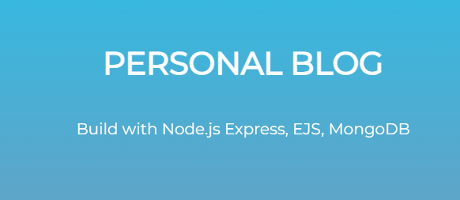

Полный код в последней ветке.

# I'm learning node js on a project №2

Practicing and learning nodejs
Learn of playlist video guide: https://www.youtube.com/playlist?list=PLNkWIWHIRwMFtsaJ4b_wwkJDHKJeuAkP0

Проект не завершенный.
Осатновился на 14 уроке: https://www.youtube.com/watch?v=9nQw4iwZGNU&list=PLNkWIWHIRwMFtsaJ4b_wwkJDHKJeuAkP0&index=14&ab_channel=webDev 

## Screenshots:
1. Home:

2. Posts:

3. Add-post:

4. Contacts:

### Start App:
npm run dev

